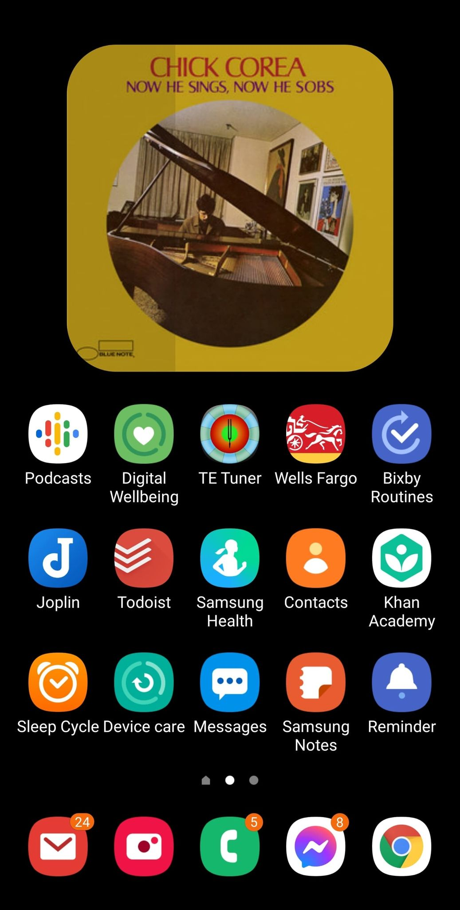

# kwgt-music-player
A simple, minimalist music player widget for Android developed using KWGT framework.

## Screenshots

The widget displays the cover art of the song that is currently playing, as shown in the below picture.

Tapping the middle third of the widget plays/pauses music from its last state (including when the music app isn't active).

Tapping the left third of the widget restarts/plays the previous track.

Tapping the right third of the widget skips the current track.

